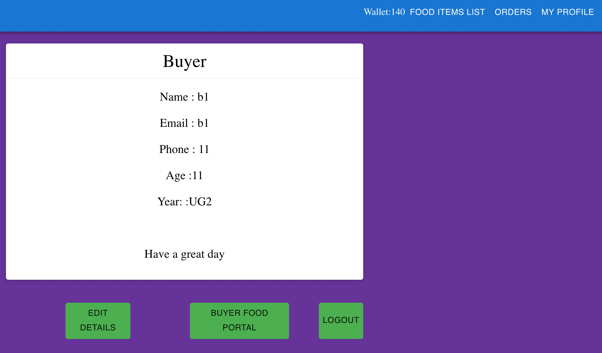

# Food portal

## For running the app

Open docker daemon and run the following command on terminal:

                      docker-compose-up

and the app will be running on port 3050 on the IP address of your network.

## Prerequisites:

### Node

* For Linux:

curl -sL https://deb.nodesource.com/setup_13.x | sudo -E bash -
sudo apt-get install -y nodejs

* For Mac:

brew install node

### MongoDB

Install the community edition [here](https://docs.mongodb.com/manual/installation/#mongodb-community-edition-installation-tutorials).

### React

npm install -g create-react-app

## Some working dashboard photos

